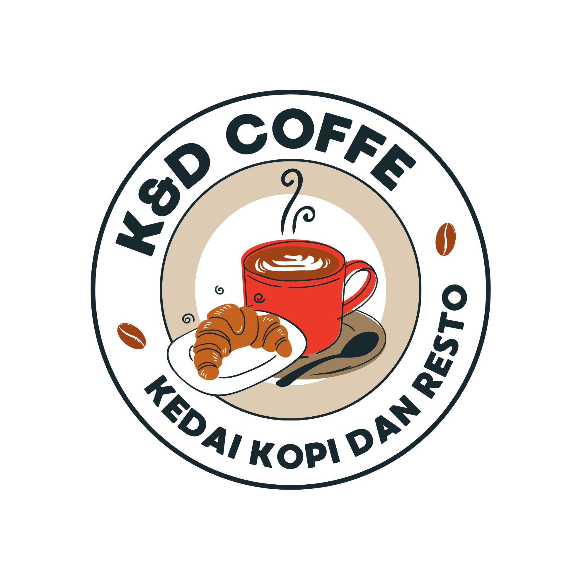

# ☕ K&D Coffee - Point of Sale System

<p align="center">
  
</p>

<p align="center">
  <b>Sistem Point of Sale Modern untuk Cafe & Resto</b><br>
  Dibangun dengan Laravel 12 & Livewire 3
</p>

<p align="center">
  
  
  
  
  
</p>

---

## 📋 Deskripsi Project

**K&D Coffee POS System** adalah aplikasi kasir modern yang dirancang khusus untuk cafe dan restoran. Sistem ini menyediakan antarmuka yang intuitif dan responsif untuk memudahkan proses transaksi penjualan, manajemen produk, dan pelaporan keuangan.

Sistem ini dikembangkan menggunakan **Laravel 12** dengan **Livewire 3** untuk interaksi real-time tanpa perlu reload halaman, memberikan pengalaman pengguna yang smooth dan modern.

---

## ✨ Fitur Utama

### 🔐 Manajemen User
- **Multi-role Access Control**: Admin dan Kasir dengan permission berbeda
- **Autentikasi Aman**: Login menggunakan Laravel Breeze
- **Profile Management**: Update profil dan password

### 🛒 Point of Sale (POS)
- **Interface Modern & Responsif**: Desain mobile-friendly untuk kemudahan penggunaan
- **Filter Kategori**: Filter produk berdasarkan Makanan, Minuman, Dessert
- **Keranjang Belanja Real-time**: Update otomatis tanpa reload
- **Multiple Payment Methods**: Cash, Transfer, E-Wallet, QRIS
- **Diskon Otomatis**: Diskon untuk pembelian rombongan (>5 item)
- **Struk Digital**: Cetak struk transaksi dengan logo dan detail lengkap

### 📦 Manajemen Produk
- **22 Produk Pre-loaded**: Menu siap pakai (Makanan, Minuman, Dessert)
- **Product Photos**: Foto produk berdasarkan kategori
- **Stock Management**: Opsi untuk produk dengan/tanpa stock
- **Harga Fleksibel**: Update harga produk dengan mudah

### 📊 Dashboard & Reporting
- **Admin Dashboard**:
  - Total pendapatan harian
  - Breakdown pendapatan per kategori (Makanan, Minuman, Dessert)
  - Total pengeluaran
  - Net income (Pendapatan - Pengeluaran)
  - Total item terjual
  - Daftar transaksi real-time
- **Kasir Dashboard**:
  - Ringkasan penjualan hari ini
  - Shortcut akses ke POS
  - Statistik items sold

### 💰 Manajemen Keuangan
- **Expense Tracking**: Catat pengeluaran operasional
- **Period Filter**: Filter laporan berdasarkan tanggal
- **Revenue Analysis**: Analisis pendapatan per kategori produk

---

## 🛠️ Tech Stack

| Technology | Version | Purpose |
|------------|---------|---------|
| **Laravel** | 12.x | PHP Framework Backend |
| **Livewire** | 3.x | Full-stack Framework (SPA-like) |
| **PHP** | 8.2+ | Programming Language |
| **MySQL** | 8.0+ | Database |
| **Tailwind CSS** | 3.x | Utility-first CSS Framework |
| **Vite** | 5.x | Frontend Build Tool |
| **Alpine.js** | 3.x | Lightweight JavaScript Framework |
| **FontAwesome** | 6.x | Icon Library |
| **DomPDF** | - | PDF Generation (Struk) |
| **Simple QR Code** | - | QR Code Generator |

---

## 📋 System Requirements

Pastikan sistem Anda memenuhi requirements berikut:

- **PHP**: >= 8.2
- **Composer**: >= 2.x
- **Node.js**: >= 18.x
- **NPM**: >= 9.x
- **MySQL**: >= 8.0 atau MariaDB >= 10.x
- **Web Server**: Apache/Nginx (atau Laragon/XAMPP untuk development)
- **Git**: Untuk clone repository

### Extension PHP yang Diperlukan:
- BCMath PHP Extension
- Ctype PHP Extension
- Fileinfo PHP Extension
- JSON PHP Extension
- Mbstring PHP Extension
- OpenSSL PHP Extension
- PDO PHP Extension
- Tokenizer PHP Extension
- XML PHP Extension
- GD PHP Extension
- cURL PHP Extension

---

## 🚀 Instalasi & Setup

### Step 1️⃣: Clone Repository

```bash
# Clone repository dari GitHub
git clone https://github.com/Nadzare/kasir-cafe.git

# Masuk ke folder project
cd kasir-cafe
```

### Step 2️⃣: Install Dependencies

```bash
# Install PHP dependencies menggunakan Composer
composer install

# Install JavaScript dependencies menggunakan NPM
npm install
```

### Step 3️⃣: Setup Environment

```bash
# Copy file .env.example menjadi .env
cp .env.example .env

# Untuk Windows (PowerShell):
# copy .env.example .env

# Untuk Windows (Command Prompt):
# copy .env.example .env
```

### Step 4️⃣: Generate Application Key

```bash
php artisan key:generate
```

### Step 5️⃣: Konfigurasi Database

**A. Buat Database Baru**

Buka phpMyAdmin atau MySQL client dan buat database:
```sql
CREATE DATABASE db_kasirpos;
```

**B. Edit File `.env`**

Buka file `.env` dan sesuaikan konfigurasi database:

```env
APP_NAME="K&D Coffee POS"
APP_ENV=local
APP_DEBUG=true
APP_URL=http://localhost:8000

DB_CONNECTION=mysql
DB_HOST=127.0.0.1
DB_PORT=3306
DB_DATABASE=db_kasirpos
DB_USERNAME=root
DB_PASSWORD=

# Untuk Laragon:
# DB_PASSWORD=

# Untuk XAMPP/WAMP:
# DB_PASSWORD=
```

### Step 6️⃣: Migrate & Seed Database

```bash
# Jalankan migration dan seeder untuk membuat tabel dan data default
php artisan migrate:fresh --seed
```

**Output yang diharapkan:**
```
✅ Users created successfully!
✅ Products created successfully!

=======================================
📝 DEFAULT LOGIN CREDENTIALS:
=======================================
👤 Admin     : admin@cafe.com
👤 Kasir     : kasir@cafe.com
🔒 Password  : password
=======================================
```

### Step 7️⃣: Build Assets

**Untuk Development (dengan Hot Reload):**
```bash
npm run dev
```
**Catatan:** Biarkan terminal ini tetap berjalan untuk hot reload.

**Untuk Production:**
```bash
npm run build
```

### Step 8️⃣: Jalankan Aplikasi

Buka terminal baru dan jalankan:

```bash
php artisan serve
```

Aplikasi akan berjalan di: **http://localhost:8000**

---

## 🔑 Default Login Credentials

Setelah migration & seeding berhasil, gunakan kredensial berikut untuk login:

| Role | Email | Password |
|------|-------|----------|
| **Admin** | admin@cafe.com | password |
| **Kasir** | kasir@cafe.com | password |

⚠️ **PENTING**: Segera ubah password default setelah pertama kali login!

---

## 📁 Struktur Folder Penting

```
kasir-cafe/
├── app/
│   ├── Http/Controllers/       # Controllers
│   ├── Livewire/              # Livewire Components
│   │   ├── PosPage.php        # Halaman POS
│   │   ├── GateScanPage.php   # (Deprecated)
│   │   └── Forms/             # Form Components
│   └── Models/                # Eloquent Models
│       ├── User.php
│       ├── Product.php
│       ├── Transaction.php
│       └── TransactionItem.php
│
├── database/
│   ├── migrations/            # Database Migrations
│   └── seeders/
│       └── DatabaseSeeder.php # Seeder (Users & Products)
│
├── public/
│   └── images/                # Gambar produk & assets
│       ├── kndlogo.png       # Logo K&D Coffee
│       ├── bgcafe.jpg        # Background Login
│       ├── makanan.jpg       # Foto Makanan
│       ├── minuman.jpg       # Foto Minuman
│       └── dessert.jpg       # Foto Dessert
│
├── resources/
│   ├── views/
│   │   ├── layouts/
│   │   │   ├── app.blade.php      # Layout utama
│   │   │   └── guest.blade.php    # Layout login
│   │   ├── livewire/
│   │   │   ├── pos-page.blade.php # POS Interface
│   │   │   └── admin-dashboard.blade.php
│   │   └── struk.blade.php        # Template Struk
│   ├── css/app.css            # Tailwind CSS
│   └── js/app.js              # JavaScript
│
└── routes/
    ├── web.php                # Web Routes
    └── auth.php               # Authentication Routes
```

---

## 🎯 Cara Penggunaan

### Login ke Sistem
1. Akses **http://localhost:8000**
2. Login menggunakan kredensial di atas
3. Setelah login, Anda akan diarahkan ke Dashboard

### Menggunakan POS (Kasir)
1. Klik menu **POS** di sidebar
2. Pilih produk yang ingin dijual (klik card produk)
3. Atur quantity jika diperlukan
4. Produk otomatis masuk ke keranjang
5. Isi nama customer (opsional)
6. Pilih metode pembayaran
7. Klik **Proses Pembayaran**
8. Struk akan otomatis muncul dan bisa dicetak

### Melihat Laporan (Admin)
1. Login sebagai Admin
2. Dashboard akan menampilkan:
   - Total pendapatan
   - Breakdown per kategori
   - Pengeluaran
   - Net income
   - Daftar transaksi
3. Filter berdasarkan tanggal untuk melihat periode tertentu

---

## 🔧 Troubleshooting

### 1. Error "These credentials do not match our records"
**Penyebab**: Database belum di-seed atau tidak ada user.

**Solusi**:
```bash
php artisan migrate:fresh --seed
```

### 2. Error "SQLSTATE[HY000] [1045] Access denied"
**Penyebab**: Konfigurasi database di `.env` salah.

**Solusi**:
- Pastikan DB_DATABASE, DB_USERNAME, DB_PASSWORD sudah benar
- Pastikan database `db_kasirpos` sudah dibuat
- Restart MySQL service

### 3. Style/CSS Tidak Muncul
**Penyebab**: Vite dev server tidak berjalan atau assets belum di-build.

**Solusi**:
```bash
# Jalankan Vite dev server
npm run dev

# Atau build untuk production
npm run build
```

### 4. Error "Class not found" atau Auto-load Error
**Penyebab**: Composer dependencies belum terinstall atau perlu regenerate autoload.

**Solusi**:
```bash
composer install
composer dump-autoload
```

### 5. Error Permission Denied (Storage/Bootstrap)
**Penyebab**: Folder storage dan bootstrap/cache tidak memiliki permission yang tepat.

**Solusi (Linux/Mac)**:
```bash
chmod -R 775 storage bootstrap/cache
```

**Solusi (Windows)**:
- Tidak perlu action khusus, permission otomatis

### 6. Error "Vite manifest not found"
**Penyebab**: Assets belum di-build.

**Solusi**:
```bash
npm run build
```

---

## 📸 Screenshots

### Login Page
Interface login modern dengan background cafe dan glassmorphism effect.

### POS Interface
Halaman kasir dengan:
- Filter kategori (Makanan, Minuman, Dessert)
- Product cards dengan foto
- Shopping cart real-time
- Summary pembayaran

### Admin Dashboard
Dashboard admin dengan:
- Statistik pendapatan
- Revenue breakdown
- List transaksi
- Filter periode

### Struk Transaksi
Struk digital yang siap print untuk thermal printer 80mm.

---

## 📝 Data Default

### Users
- **Admin**: admin@cafe.com / password
- **Kasir**: kasir@cafe.com / password

### Products (22 Items)
**Makanan (5 items)**:
- Nasi Goreng - Rp 25.000
- Nasi Kebuli - Rp 35.000
- Rice Bowl - Chicken Katsu - Rp 30.000
- Rice Bowl - Beef Teriyaki - Rp 35.000
- Rice Bowl - Sambal Matah - Rp 32.000

**Minuman (5 items)**:
- Air Putih - Rp 5.000
- Es Teh - Rp 8.000
- Vanilla Latte - Rp 25.000
- Matcha Latte - Rp 28.000
- Redvelvet Latte - Rp 28.000

**Dessert (12 items)**:
- Cheesecake - Rp 35.000
- Brownies - Rp 20.000
- Puding - Rp 15.000
- Es Krim - Rp 18.000
- Gelato - Rp 25.000
- Tiramisu - Rp 38.000
- Waffle - Rp 30.000
- Crepes - Rp 28.000
- Salad Buah - Rp 22.000
- Mousse - Rp 32.000
- Macarons - Rp 40.000
- Poffertjes - Rp 25.000

---

## 🤝 Contributing

Contributions are welcome! Jika Anda ingin berkontribusi:

1. Fork repository ini
2. Buat branch baru (`git checkout -b feature/AmazingFeature`)
3. Commit perubahan (`git commit -m 'Add some AmazingFeature'`)
4. Push ke branch (`git push origin feature/AmazingFeature`)
5. Buat Pull Request

---

## 📄 License

Project ini adalah open-source dan tersedia di bawah [MIT License](LICENSE).

---

## 👨‍💻 Developer

Dikembangkan oleh **Nadzare Kafah**

- GitHub: [@Nadzare](https://github.com/Nadzare)
- Repository: [kasir-cafe](https://github.com/Nadzare/kasir-cafe)

---

## 📞 Support

Jika mengalami kendala atau ada pertanyaan:

1. Buka **Issues** di GitHub repository
2. Berikan detail error/pertanyaan dengan jelas
3. Sertakan screenshot jika memungkinkan

---

<p align="center">
  Made with ❤️ using Laravel & Livewire
</p>

<p align="center">
  <b>K&D Coffee POS System © 2026</b>
</p>
